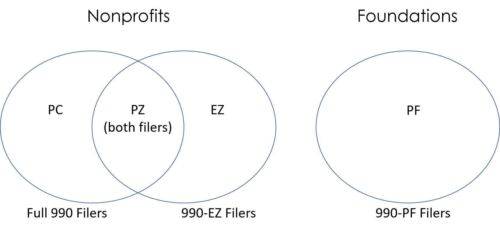
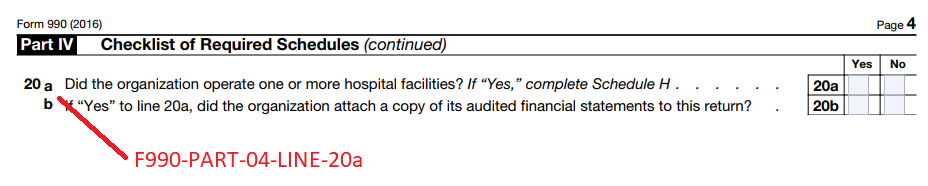
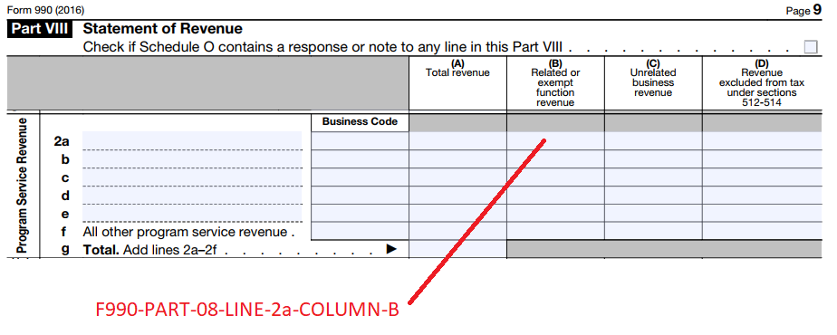

This repository provides documentation for the Master Concordance File, the rosetta stone needed to convert IRS 990 E-Filer XML documents on AWS into structured databases.

The data dictionary below describes fields in the Master Concordance File. Click here for a [data dictionary describing all variables on the 990 forms](data_dictionary.html).

[Submit questions and issues here](https://github.com/Nonprofit-Open-Data-Collective/irs-efile-master-concordance-file/issues/new).


### Acknowledgements

*Created by the [Nonprofit Open Data Collective](https://nonprofit-open-data-collective.github.io/) under the [GPL-3.0](https://opensource.org/licenses/GPL-3.0) open source license for free use by all*.

Many thanks to all of those that have helped generate this file, but especially to the Aspen Institute for hosting the initial ["Datathon" event](https://www.aspeninstitute.org/blog-posts/aspen-institutes-program-philanthropy-social-innovation-psi-hosts-nonprofit-datathon/), and to Miguel Barbosa at Citizen Audit for volunteering a week's worth of time to generate a large portion of the first draft of this file. 


# DATA DICTIONARY 

The MasterConcordanceFile.csv included in this repository consists of the following variables:

* **VARIABLE_NAME** - Name of research database variable
* **DESCRIPTION** - Definition of the variable, derived from 990 forms
* **SCOPE** - Filers to which the variable pertains (small charities, large charities, all charities, foundations)
* **LOCATION_CODE** - The location of a field (form, part, and line) on the 2016 paper version of forms and schedules
* **FORM** - Form on which the field occurs - 990, 990EZ, 990PF, Schedule A - Schedule R
* **PART** - Location of the field on the form
* **RDB_TABLE** - Tables for organizing the data into a relational database
* **PRODUCTION_RULE** - Rules which should be applied to the raw data after extraction to ensure it is meaningful
* **XPATH** - XML address for the data
* **VERSION** - The XSD schema version that the xpath belongs to
* **REQUIRED** - Indicates whether nonprofit filers are required to complete this field
* **NOTES** - Additional notes about variables from programmers and users

A more in-depth description of each is covered below.


### VARIABLE_NAME

Name of the variables in the research database.

Each variable name begins with a 6-letter prefix the follows the pattern: XX_XX_XX_NAME.

Since there are over 6,500 unique variables, the prefix helps organize the variables into groups. The prefix indicates the FORM, SCOPE, and LOCATION of the variable.

FORM (see below for more info):
* F9 - Variable occurs on Form 990, 990-EZ, or 990-PF
* SA, SB, ... SR - Variable occurs on Schedule A to Schedule R
* 3-character codes followed by a PF scope indicate auxillary scheduled for foundations

SCOPE
* PC - Variable relevant ONLY to full form 990 nonprofit filers
* EZ - Variable relevant ONLY to 990-EZ nonprofit filers
* PZ - Variable relevant to BOTH full 990 and 990-EZ nonprofit filers
* PF - Variable relevant only to foundations


LOCATION - two digit code indicating the PART of the 990 form, or groups of variables.
* 00 - Variable occurs outside of a section ("Part") on the 990 form, typically the header
* 01 - Variable occurs in Part I of the form
* 02 - Variable occurs in Part II of the form
* Etc.


### DESCRIPTION

Definition of the field on the 990 forms.


### SCOPE



Each nonprofit will file a different 990 form. Typically large nonprofits file the full 990 form (which we are labeling the 990-PC form). Small nonprofits file If we want to examine data available for ALL nonprofits, we need to rely on a set of variables that appear on both 990 and 990-EZ forms. The scope code was created to describe which set of filers for which information is available in a given variable. This specifically helps address the problem of interpretting missing values - is it missing because the nonprofit did not fill out the field, and thus it should be interpretted as zero or false, or because the field was not available on the specific form that the nonprofit used.

The PC, EZ, and PZ codes indicate variables related to public charities / nonprofit organizations. The PF code indicates variables that pertain to foundations.

* **PC** - Variable present ONLY on the full 990-PC form for public charities / nonprofits 
* **EZ** - Variable present ONLY on the 990-EZ form for charities / nonprofits 
* **PZ** - Variable present on BOTH the PC and EZ versions for charities / nonprofits 
* **PF** - Variable present on form 990-PF for foundations 


Schedules have the following scope, meaning organizations that file the main form PC, EZ, or PF can file the Schedule when necessary:

* Schedule A: **PC** AND **EZ**
* Schedule B: **PC** AND **EZ** AND **PF**
* Schedule C: **PC** AND **EZ**
* Schedule D: **PC**
* Schedule E: **PC** AND **EZ**
* Schedule F: **PC**
* Schedule G: **PC** AND **EZ**
* Schedule H: **PC**
* Schedule I: **PC**
* Schedule J: **PC**
* Schedule K: **PC**
* Schedule L: **PC** AND **EZ**
* Schedule M: **PC**
* Schedule N: **PC** AND **EZ**
* Schedule O: **PC** AND **EZ**
* Schedule R: **PC**


### LOCATION_CODE





Location codes indicate the location on the paper version of the 990 form for easy of look-up.

Note that we have used the IRS 2016 versions of forms and schedules to create location codes. Location of fields may change over time as forms are revised.

The location code is meant to be hierarchical and approximate organized as:

FORM -> PART -> LINE -> SUBLINE or COLUMN

All location codes begin with either F990-PC, F990-EZ, F990-PF, or SCHED-A through SCHED-R.

Some foundations are requird to submit auxillary schedules. These are indicated by AUX-SCHED after the location code.


### FORM

A 2 or 3-character code representing the form or schedule from which the variable is derived.

CODE | FORM | NUMBER OF ASSOCIATED XPATHS |
-----|------|------------------|
F9 | Form 990 | 4534 
SA  | Schedule A | 977 
SB | Schedule B |  1303 
SC  | Schedule C | 321 
SD | Schedule D | 436 
SE | Schedlue E | 70 
SF | Schedule F | 116 
SG | Schedule G | 482 
SH | Schedule H | 863 
SI | Schedule I | 102 
SJ | Schedule J  | 121 
SK | Schedule K | 151 
SL | Schedule L | 108 
SM | Schedule M | 315 
SN | Schedule N | 220 
SO | Schedule O | 6 
SR | Schedule R | 417 
TFC | 990-PF Auxillary Schedule | 62 
ERS | 990-PF Auxillary Schedule | 57 
BFE | 990-PF Auxillary Schedule | 47 
TTC | 990-PF Auxillary Schedule | 47 
DDI | 990-PF Auxillary Schedule | 45 
SCS | 990-PF Auxillary Schedule | 41 
GLS | 990-PF Auxillary Schedule | 39 
MNP | 990-PF Auxillary Schedule | 34 
ONL | 990-PF Auxillary Schedule | 30 
ORO | 990-PF Auxillary Schedule | 26 
LFO | 990-PF Auxillary Schedule | 24 
DSD | 990-PF Auxillary Schedule | 22 
ASA | 990-PF Auxillary Schedule | 18 
OIS | 990-PF Auxillary Schedule | 14 
CEC | 990-PF Auxillary Schedule | 11 
AFS | 990-PF Auxillary Schedule | 10 
CCE | 990-PF Auxillary Schedule | 10 
ILS | 990-PF Auxillary Schedule | 10 
LES | 990-PF Auxillary Schedule | 10 
LFS | 990-PF Auxillary Schedule | 10 
OES | 990-PF Auxillary Schedule | 10 
OPF | 990-PF Auxillary Schedule | 10 
TST | 990-PF Auxillary Schedule | 10 
IOS | 990-PF Auxillary Schedule | 9 
IGO | 990-PF Auxillary Schedule | 8 
OAS | 990-PF Auxillary Schedule | 8 
ONS | 990-PF Auxillary Schedule | 8 
SOI | 990-PF Auxillary Schedule | 8 
GEA | 990-PF Auxillary Schedule | 6 
ICB | 990-PF Auxillary Schedule | 6 
ICS | 990-PF Auxillary Schedule | 6 
ODS | 990-PF Auxillary Schedule | 6 
OLS | 990-PF Auxillary Schedule | 6 
AOP | 990-PF Auxillary Schedule | 4 
ECE | 990-PF Auxillary Schedule | 4 
GLP | 990-PF Auxillary Schedule | 4 
ANP | 990-PF Auxillary Schedule | 2 
ATP | 990-PF Auxillary Schedule | 2 
CDC | 990-PF Auxillary Schedule | 2 
CDE | 990-PF Auxillary Schedule | 2 
DFC | 990-PF Auxillary Schedule | 2 
ELP | 990-PF Auxillary Schedule | 2 
ENF | 990-PF Auxillary Schedule | 2 
LEE | 990-PF Auxillary Schedule | 2 
OCN | 990-PF Auxillary Schedule | 2 
RCE | 990-PF Auxillary Schedule | 2 
RSE | 990-PF Auxillary Schedule | 2 
SES | 990-PF Auxillary Schedule | 2 
TUS | 990-PF Auxillary Schedule | 2 
EBT | 990-PF Auxillary Schedule | 1 


### PART

Reports the location of the field on the 990 forms for ease of look-up and to organize variables by groups.

*Note that PZ fields reference the location on the 2016 full 990 form, which will rarely be located in the same place on the 990-EZ form. This is for visual reference only.*


### RDB_TABLE

This field (*not yet implemented*) provides a relational database structure for the data. Many fields in the dataset are one-to-one, meaning for each nonprofit there will be a unique value. These fields appear on the main table for the form.

Some fields have a one-to-many relationship. There are many board members for each nonprofit, there are several program activities reported, etc. In these cases, each new table defines a set of fields that function together. A compensation table. A nonprofit activities table. Etc.


### PRODUCTION_RULE

Xpaths contained in the Master Concordance File are used to extract data from XML files and convert it into a more structured format. Production rules represent anything that should be done to the raw data after it is extracted from XML files to standardize the data or make it more useful.

For example, in some versions of forms a checked checkbox will be represented as an "X", and in others as a "Y" or "1". These all mean the same thing, so they should be re-coded with the same value. This is a suggested production rule.


### XPATH

The "address" of the variable on the XML forms released on Amazon.

For an overview of using xpaths in R, see the [Quick Guide to XML in R](Quick_Guide_to_XML_in_R.html).


### VERSION

The IRS has revised the 990 and updated e-filing forms many times. This field contains the XSD version information necessary to match schemas to XML documents.


### REQUIRED

Is the specific field required for the particular filer in order to submit your 990 data to the IRS? 

The e-filing system provides some validation to ensure necessary fields are complete. It may not be strictly enforced, though.


```{css}
p {
color: black;
margin: 0 0 20px 0;
}

td {
    padding: 3px 10px 3px 10px;
    text-align: center;
}

table
{ 
    margin-left: auto;
    margin-right: auto;
    margin-top:80px;
    margin-bottom:100px;
}

h1, h2{
  margin-top:100px;
  margin-bottom:20px;
}

h3{
  margin-top:50px;
  margin-bottom:20px;
}

H5{
    text-align: center;
    color: gray;
    font-size:0.8em;
}

img {
    max-width: 90%;
    display: block;
    margin-right: auto;
    margin-left: auto;
    margin-top:30px;
    margin-bottom:20px;
}

pre {
  overflow-x: auto;
}

pre code {
   display: block; 
   padding: 0.5em;
   margin-bottom:20px;
}

code {
  font-size: 92%;
  border: 10px solid #F8F8F8;
  margin-bottom: 2px;
}

code[class] {
  background-color: #F8F8F8;
}

```


