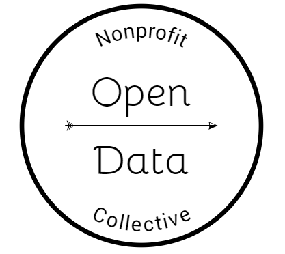

This page provides documentation for the ***Master Concordance File***, the "rosetta stone" that facilitates the conversion of IRS 990 E-Filer XML documents [on AWS](https://aws.amazon.com/public-datasets/irs-990/) into structured databases.

The data dictionary below documents the xpath to variable mapping contained in the Master Concordance File. Click here for a [DATA DICTIONARY](data_dictionary.html) describing unique variables on the 990 forms.

Please submit [QUESTIONS AND ISSUES](https://github.com/Nonprofit-Open-Data-Collective/irs-efile-master-concordance-file/issues/new) through GitHub.


#### Acknowledgements

*Created by the [Nonprofit Open Data Collective](https://nonprofit-open-data-collective.github.io/) under the [GPL-3.0](https://opensource.org/licenses/GPL-3.0) open source license for free use by all*.

Many thanks to all of those that have helped generate this file, but especially to the Aspen Institute for hosting the initial ["DATATHON"](https://www.aspeninstitute.org/blog-posts/aspen-institutes-program-philanthropy-social-innovation-psi-hosts-nonprofit-datathon/)event which kicked us off, and to Miguel Barbosa at Citizen Audit for generating a large portion of the first draft of this file. 


## DATA DICTIONARY 

The MasterConcordanceFile.csv included in this repository consists of the following variables:

* **variable_name** - Name of research database variable
* **description** - Definition of the variable, derived from 990 forms
* **scope** - Filers to which the variable pertains (small charities, large charities, all charities, foundations)
* **location_code** - The location of a field (form, part, and line) on the 2016 paper version of forms and schedules
* **form** - Form on which the field occurs - 990, 990EZ, 990PF, Schedule A - Schedule R
* **part** - Location of the field on the form
* **data_type** - Data field type (number, character, address, date, currency, etc.)  
* **required** - Indicates whether nonprofit filers are required to complete this field  
* **cardinality** - Is the variable-to-nonprofit relationship one-to-one or one-to-many
* **rdb_table** - Tables for organizing the data into a relational database  
* **xpath** - XML address for the data
* **version** - The XSD schema version that the xpath belongs to
* **production_rule** - Rules which should be applied to the raw data after extraction to ensure it is meaningful
* **last_version_modified** - Most recent date the row of data was updated

A more in-depth description of each variable is covered below.

The current status of each of these fields is:


FIELD  |  STATUS  |  VALIDATED?
:------|:---------|:------------
variable_name | Complete | YES  
description | Complete | Yes  
scope | Complete | NO  
location_code | Complete | NO  
form | Complete | YES  
part | Complete | NO  
data_type | In Progress | NO  
required | In Progress | NO  
cardinality | No Data Yet | No  
rdb_table | No Data Yet | NO  
xpath | Complete | YES  
version | Complete | YES  
production_rule | No Data Yet | NO  


### variable_name

Each variable name begins with a 6-letter prefix the follows the pattern: **XX_XX_XX_NAME**

Since there are over 6,500 unique variables, the prefix helps organize the variables into groups. The prefix indicates the FORM, SCOPE, and LOCATION of the variable.

**FORM** (see below for more info):  
* F9 - Variable occurs on Form 990, 990-EZ, or 990-PF  
* SA, SB, ... SR - Variable occurs on Schedule A to Schedule R  
* 3-character codes followed by a PF scope indicate auxillary scheduled for foundations  


**LOCATION** - two digit code indicating the PART of the 990 form, or groups of variables.
* 00 - Variable occurs outside of a section ("Part") on the 990 form, typically the header  
* 01 - Variable occurs in Part I of the form  
* 02 - Variable occurs in Part II of the form 
* Etc. 

**SCOPE**  
* HD - Header and signature block variables that are identical across PC, EZ, and PF forms  
* PC - Variable relevant ONLY to full form 990 nonprofit filers  
* EZ - Variable relevant ONLY to 990-EZ nonprofit filers  
* PZ - Variable relevant to BOTH full 990 and 990-EZ nonprofit filers  
* PF - Variable relevant only to foundations  


*Variable with SB scope are an edge case associated with a small number of xpaths. These variables can occur either in the header or signature block. Since the signature block is in a different location on each form, When variables have SB scope they will always have a location of 00 for consistency across the forms, even though in two cases they are assigned their own part.*

Each variable has been assigned a unique name. One variable might appear several times in the concordance file in circumstances where multiple xpaths map onto the same variable. This happens when xpaths have changed over different versions of the IRS e-filer schema, or when the same variable occurs on both the 990-PC and 990-EZ forms.


### description

Definition of the variable based upon information on the 990 forms.


### scope


Nonprofits can e-file two versions of the 990 form. Typically large nonprofits file the full 990 form (which we are calling the 990-PC form). Small nonprofits file the 990-EZ form. 

The scope codes, PC, EZ, and PZ describes the population that a variable covers. The PZ code has the largest scope since this set of variables occur on both the full 990 and the 990-EZ forms. The PC code refers to variables that are ONLY on the full 990 form. The EZ code refers to variables ONLY on the 990-EZ form. 

All foundations file the same form. All of the variables from that form are designated by the PF (private foundation) scope code.

If we want to conduct a study on the population of active nonprofits then we need to rely on the PZ subset of variables.

* **HD** - Header and signature block variables relevant to ALL filers (PC, EZ, and PF) 
* **PC** - Variable present ONLY on the full 990-PC form for public charities / nonprofits 
* **EZ** - Variable present ONLY on the 990-EZ form for charities / nonprofits 
* **PZ** - Variable present on BOTH the PC and EZ versions for charities / nonprofits 
* **PF** - Variable present on form 990-PF for foundations 


Some schedules are only relevant for nonprofits filing the full 990-PC form. The only schedule that foundations file is Schedule B. Thus, variables on the schedules have the following scope:

* Schedule A: **PC** AND **EZ**
* Schedule B: **PC** AND **EZ** AND **PF**
* Schedule C: **PC** AND **EZ**
* Schedule D: **PC**
* Schedule E: **PC** AND **EZ**
* Schedule F: **PC**
* Schedule G: **PC** AND **EZ**
* Schedule H: **PC**
* Schedule I: **PC**
* Schedule J: **PC**
* Schedule K: **PC**
* Schedule L: **PC** AND **EZ**
* Schedule M: **PC**
* Schedule N: **PC** AND **EZ**
* Schedule O: **PC** AND **EZ**
* Schedule R: **PC**


### location_code


Location codes indicate the location of the field on the paper version of the 990 form for easy of look-up.

The location code is meant to be hierarchical and approximate organized as:

FORM -> PART -> LINE -> SUBLINE or COLUMN

Note that location of fields on 990 forms may change over time as forms are revised. We have defined location codes based upon the [IRS 2016 versions of forms and schedules](https://github.com/Nonprofit-Open-Data-Collective/irs-efile-master-concordance-file/tree/master/990_forms). 

All location codes begin with either F990-PC, F990-EZ, F990-PF, or SCHED-A through SCHED-R.

Some foundations are requird to submit auxillary schedules. These are indicated by AUX-SCHED after the location code.


### form

A 2-character code representing the form or schedule from which the variable is derived.

```{r, warning=F, message=F, echo=F}

library( knitr )

dat <- read.csv( "../efiler_master_concordance.csv" )


t1 <- table( dat$form )

t2 <- tapply( dat$variable_name, dat$form, function(x){ length( unique(x) ) } )

d <- data.frame( t1, t2 )

row.names( d ) <- NULL

temp.form <- substr( dat$variable_name, 1, 2 )

to.merge <- unique( data.frame( code=temp.form, form=dat$form  ) )

d <- merge( to.merge, d, by.x="form", by.y="Var1" )

names(d) <- c("FORM_NAME","FORM_CODE","NUMBER_OF_ASSOCIATED_XPATHS","NUMBER_OF_ASSOCIATED_VARIABLES")

d <- d[ c("FORM_CODE","FORM_NAME","NUMBER_OF_ASSOCIATED_VARIABLES","NUMBER_OF_ASSOCIATED_XPATHS") ]

kable( d )

```


### part

Reports the location of the field on the 990 forms for ease of look-up and to organize variables by groups.

*Note that PZ fields occur on both the 990-PC and 990-EZ forms. The part code references the location on the full 990-PC form, which will rarely be in the same place on the 990-EZ form. If you need the location of PZ variables on the EZ form use the location codes instead.*


### data_type

Field data type, derived from IRS XSD schema files. 

```{r, echo=F}

df1 <- as.data.frame( sort( table( dat$data_type ), T ) )

names( df1 ) <- c("Data_Type","Frequency" )

kable( df1  )

```


### required

Is the specific field required for the particular filer in order to submit your 990 data to the IRS? 

The e-filing system provides some validation to ensure necessary fields are complete. It may not be strictly enforced, though.


### cardinality

Definition of the variable relationship to the filing nonprofit. 

* **ONE-TO-ONE** - Each of these variable occurs only one time on the 990 return

Examples include nonprofit name and nonprofit EIN - values that are unique and occur once on the form.

* **ONE-TO-MANY** - Variables that can occur many times on a return

Examples include grants given, names of board members, and program accomplishments - anything that might occur multiple times on a 990 return.


### rdb_table

This field (*not yet implemented*) provides a relational database structure for the data. Many fields in the dataset are one-to-one, meaning for each nonprofit there will be a unique value. These fields appear on the main table for the form.

Some fields have a one-to-many relationship. There are many board members for each nonprofit, there are several program activities reported, etc. In these cases, each new table defines a set of fields that function together. A compensation table. A nonprofit activities table. Etc.

The names of tables will follow this convention:

**HEADER** - Table of unique (OTO) header data for each nonprofit / foundation
**PC-OTO-TABLE_NAME** - One-to-one table from the 990-PC form
**SA-OTM-TABLE_NAME** - One-to-many table from Schedule A


* PC / EZ / PZ / PF = scope codes (if scope = HD then table name = HEADER) 
* OTO = one-to-one relationships only  
* OTM = one-to-many relationships   
* TABLE_NAME - informative name describing group of variables (for example, compensation, expenses, etc.)  

Every table should include the following header variables to ensure they can be joined properly (these variables are designated by the table name "HEADER"):

* Nonprofit name 
* Nonprofit EIN 
* Form 
* Tax year 
* Submission version / timestamp 
* Document Locator Number for the return  

In the future consider adding the variables to tables for ease of subsetting:

* NTEE codes (or other system)  
* Organizational type (charity, community foundation, supporting nonprofit, etc.)  
* Geography (state, MSA, city, zip, county)  
* Size (5 ranges)  


### xpath

The "address" of the variable on the XML forms released on Amazon.

For an overview of using xpaths in R, see the [Quick Guide to XML in R](Quick_Guide_to_XML_in_R.html).


### version

The IRS has revised the 990 and updated e-filing forms many times. This field contains the XSD version information necessary to match schemas to XML documents.


### production_rule

Xpaths contained in the Master Concordance File are used to extract data from XML files and convert it into a more structured format. Production rules represent anything that should be done to the raw data after it is extracted from XML files to standardize the data or make it more useful.

For example, in some versions of forms a checked checkbox will be represented as an "X", and in others as a "Y" or "1". These all mean the same thing, so they should be re-coded with the same value. This is a suggested production rule.


### last_version_modified

This field contains a record of when specific variables have been last updated.


```{css}
p {
color: black;
margin: 0 0 20px 0;
}

td {
    padding: 3px 10px 3px 10px;
    text-align: left;
}

table
{ 
    margin-left: auto;
    margin-right: auto;
    margin-top:80px;
    margin-bottom:100px;
}

h1{
  margin-top:100px;
  margin-bottom:20px;
  text-align: center;
  color: white;
  background: black;
}

h2{
  margin-top:100px;
  margin-bottom:20px;
  font-family: "Century Gothic";
  font-size: 40px;
}

h3{
  margin-top:50px;
  margin-bottom:20px;
  background: lightgray;
}

H5{
    text-align: center;
    color: gray;
    font-size:0.8em;
}

img {
    max-width: 90%;
    display: block;
    margin-right: auto;
    margin-left: auto;
    margin-top:30px;
    margin-bottom:20px;
}

pre {
  overflow-x: auto;
}

pre code {
   display: block; 
   padding: 0.5em;
   margin-bottom:20px;
}

code {
  font-size: 92%;
  border: 10px solid #F8F8F8;
  margin-bottom: 2px;
}

code[class] {
  background-color: #F8F8F8;
}

```


